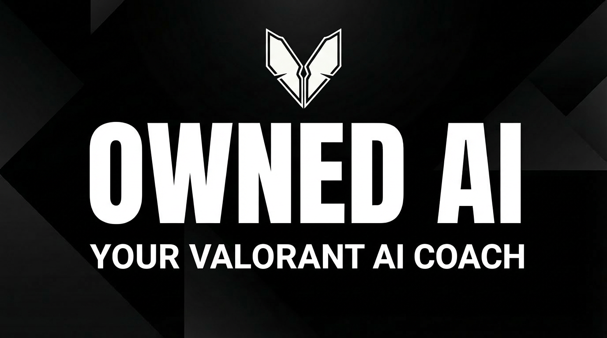
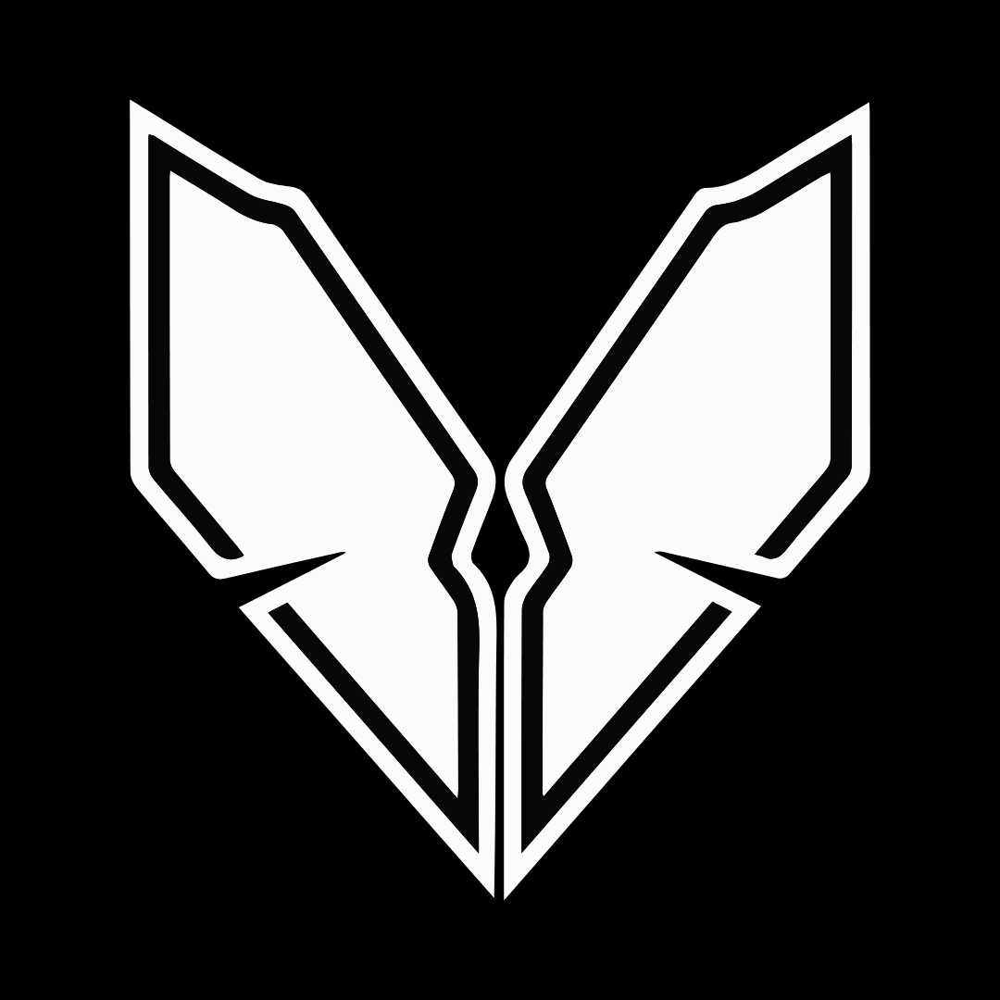

<div align="center">
  

  <br />
  <br />

  

  # OWNED - AI Valorant Coach

  **Dominate the lobby with real-time AI insights.**

  [](https://reactjs.org/)
  [](https://www.typescriptlang.org/)
  [](https://tailwindcss.com/)
  [](https://overwolf.com/)

</div>

<br />

## 🚀 About OWNED

**OWNED** is an advanced AI coaching companion for VALORANT, built on the Overwolf platform. It is designed to help players of all skill levels improve by providing real-time, context-aware advice and deep post-match analysis.

Our mission is to democratize high-level coaching, giving every player the tools they need to climb the ranks.

## ✨ Features

- **🧠 Real-Time AI Coaching**: Get live tips on agent usage, economy management, and map positioning while you play.
- **📊 Deep Post-Match Analysis**: Visualize your performance with detailed stats on K/D, ACS, Headshot %, and Win Rate.
- **🔒 Secure & Safe**: Built with Riot Sign-On (RSO) to ensure your data is accessed securely and with your consent.

## 🛠️ Tech Stack

- **Frontend**: React, Vite, Tailwind CSS
- **Animations**: Framer Motion, GSAP, OGL (WebGL)
- **Platform**: Overwolf
- **Data**: Riot API (Account-V1, Val-Match-V1, Val-Ranked-V1)    

## 🧩 Overwolf development workflow

Use `dist/` as the only Overwolf app root. Do **not** load the repository root as an
unpacked extension; the root contains source files, scripts, diagnostics, and old
artifacts that are not a valid Overwolf runtime package.

```bash
npm run build:ow
```

Then load unpacked from:

```text
c:\Users\Z1n3x\Downloads\valorant-coach\dist
```

For an OPK release package:

```bash
npm run release:opk
```

The package validator locks the UID-driving identity fields to minimize
authorization mistakes:

- `meta.name`: `OWNED`
- `meta.author`: `OWNED Team`
- `minimum-overwolf-version`: `0.257.0`

Overwolf derives the app UID from exact `meta.name` + `meta.author`. Changing
capitalization, spacing, or either string can make the local app look like a
different app to Overwolf and trigger **Unauthorized App**.

If authorization still fails after a clean build, confirm that the Overwolf
desktop client is logged into a whitelisted developer account that belongs to the
Dev Console team/app registered with `OWNED` / `OWNED Team`.


<div align="center">
  <sub>Built with ❤️ by the OWNED Team</sub>
</div>
